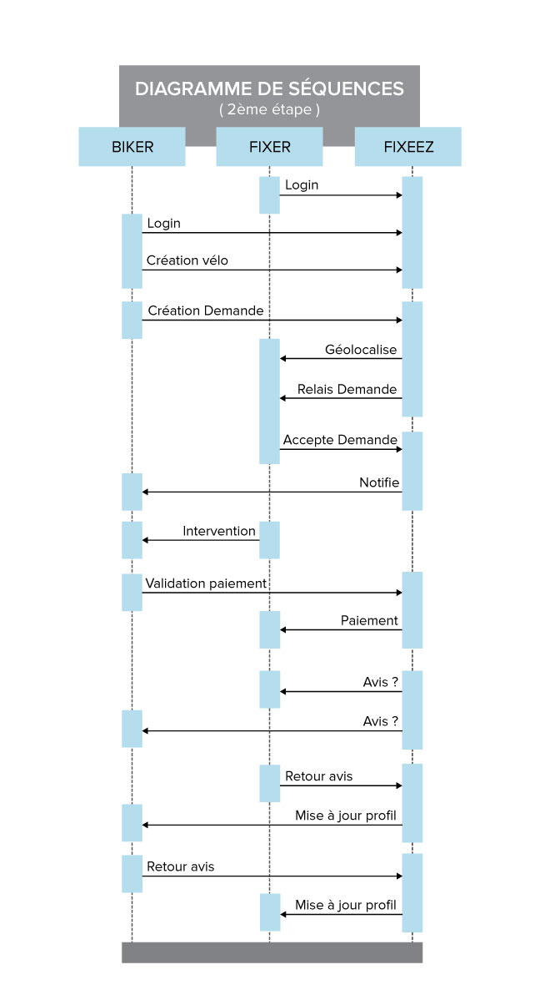
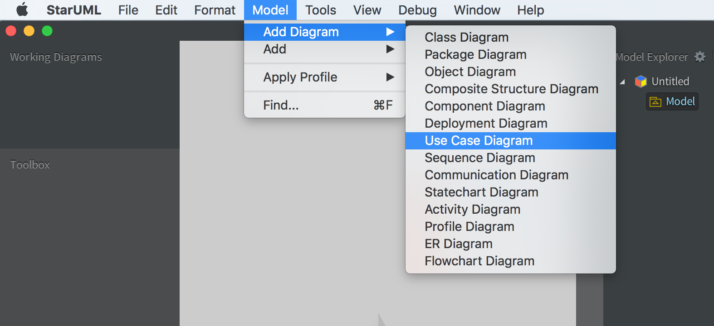

----------------------

# Diagramme de Séquence

Ce chapitre s'inscrit dans le module diagramme [Diagramme UML](https://github.com/simplonco/Diagrammes-UML).

1. [ ] [Diagramme Use-Case](https://github.com/simplonco/UML-Use-Case)
	
2. [x] [Diagramme de Séquence](https://github.com/simplonco/UML-Sequence)
	
3. [ ] [Diagramme d'Intéraction](https://github.com/simplonco/UML-Interaction)
	
4. [ ] [Diagramme de Classe](https://github.com/simplonco/UML-Class)

Vous pouvez trouver ce module dans les parcours suivants :

+ Développeur Web Fullstack

-----------

Le diagramme de séquence va s'appuyer sur le [use-case](https://github.com/simplonco/UML-Use-Case).

Son but est de séquencer dans le temps les différentes actions et allers-retours qui décriront l'utilisation du produit.

Dans le cadre de notre application nous avons deux acteurs et l'application elle-même.

+ On va donc créer les 3 branches (aussi appelées _lifelines_ ) nécessaires pour décrire les différentes intéractions dans le temps.
+ Utiliser le [use-case](https://github.com/simplonco/UML-Use-Case) pour voir quelles actions sont faites.
+ Les ordonner dans le temps.

##Les outils
Pour faire un diagramme de séquence avec StarUML c'est très simple :

Step 1 : Créer un model de séquence.

